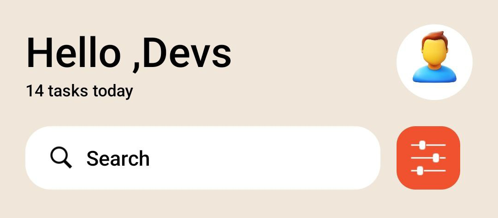
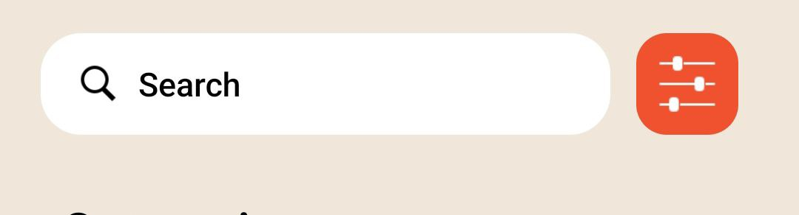
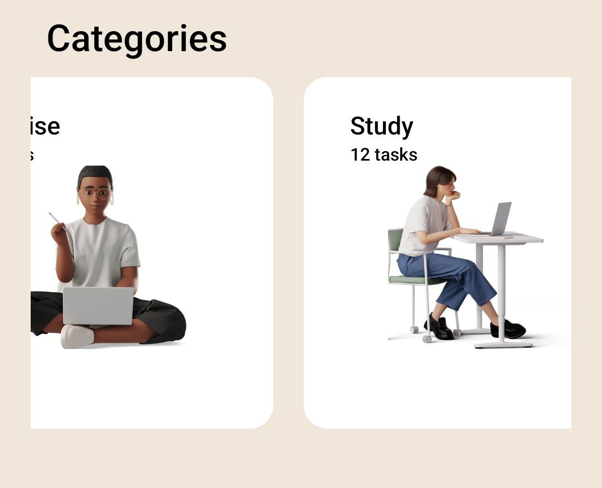
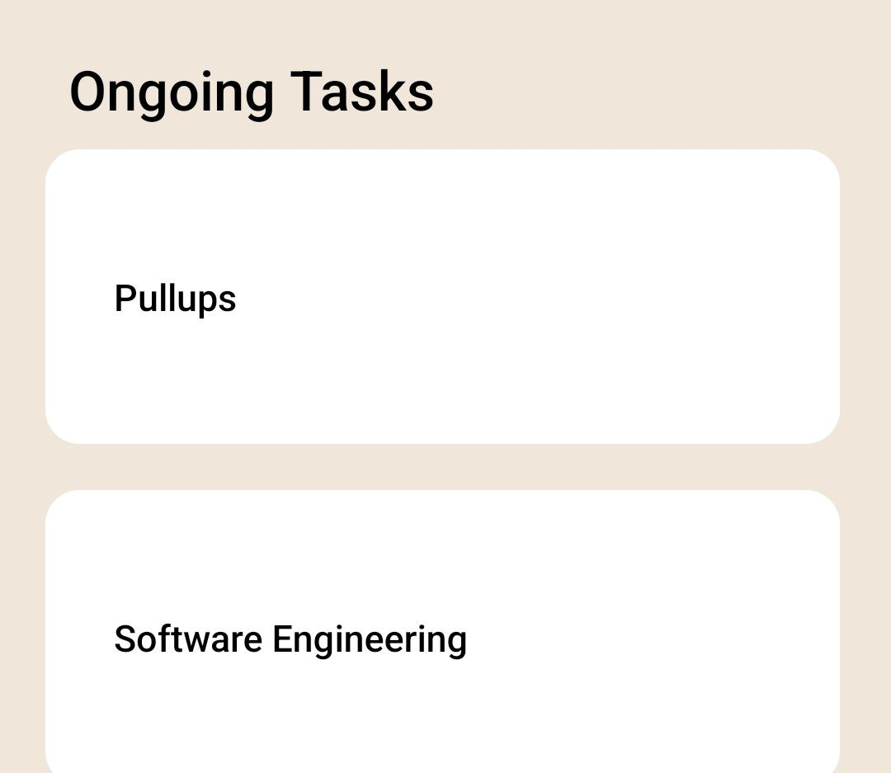
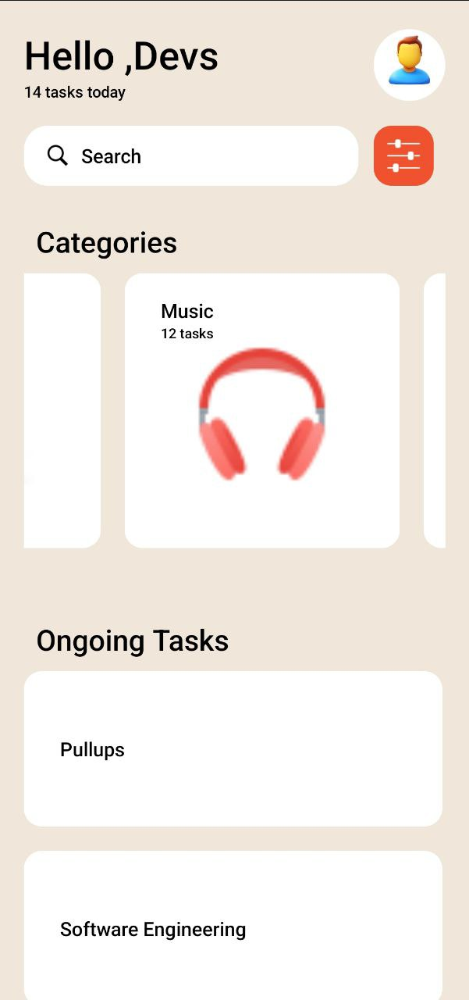

# React Native Task Management App
This React Native application displays task categories and ongoing tasks in a visually appealing layout. The app uses the FlatList component to render horizontal and vertical lists of items.

## Table of Contents
* Installation
* Usage
* Components
* Data
* Styles

## Installation
1. Clone the repository:
    git clone https://github.com/Charles543/rn-assignment3-11021370/task-management-app.git

2. Navigate to the project directory:
    cd task-management-app

3. Install the dependencies:
    npm install

4. Start the development server:
    npm start

5. Use the Expo Go app to scan the QR code and view the app on your mobile device.
## Usage
    The app has two main sections:

1. ### Categories: 
    Displayed as a horizontal list of cards.
2. ### Ongoing Tasks: 
    Displayed as a vertical list of cards.
## Main Components and Props
* #### SafeAreaView:
    Ensures the app content is rendered within the safe area boundaries of a device.
* #### View:
    Containers for layout and styling.
* #### FlatList: 
    Efficiently renders large lists and scrollable content.

## Rendering Items

* #### renderItem: 
    Renders each category card.
* #### renderItem2: 
    Renders each ongoing task

## Components
### App Component
The main component of the app. It includes the following sections:

* Greeting and profile picture
* Search bar and filter button
* Horizontal list of categories
* Vertical list of ongoing tasks

#### Category Cards
Each category card displays:

* Title
* Number of tasks
* Image
#### Vertical Category Cards
Each vertical category card displays:
* Title

## Data Structure
The app uses two arrays to store category and task data:

### Category Data
Stores the information for the horizontal list of categories, including:

* id: Unique identifier for the category
* title: Name of the category
* image: Image representing the category
* tasks: Array of tasks associated with the category

### Task Data
Stores the information for the vertical list of ongoing tasks, including:
* id: Unique identifier for the task
* title: Name of the task
* category: Category associated with the task

## Assets
Make sure you have the following assets in your project directory under `./assets`:

* `exercise.png`
* `study.png`
* `airpods.png`
* `workout.png`
* `cooking.png`
* `code.png`
* `token.png`
* `referral.png`
* `profile2.png`
* `magnifying.png`
* `filter.png`

## Screenshots
    

    

    

    

    

    <h2>Top Section</h2>
    
    <h2>Search bar</h2>

  
    <h2>Category Section</h2>

  
  <h2>Ongoing Tasks</h2>
  
  <h2>Full view</h2>
  

